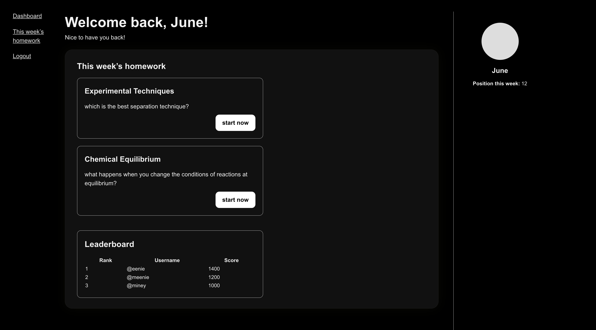
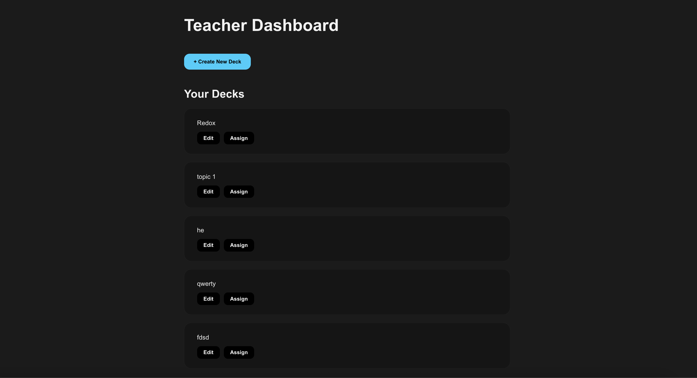

# **ChemDecks**

ChemDecks is a full-stack flashcard learning platform for Chemistry students and teachers.

Teachers can create and assign flashcard decks, while students complete interactive quizzes and track their progress.

---

## 📸 **Screenshots**

### **Student Dashboard**



### **Teacher Dashboard**



---

## **App Name & Description**

**ChemDecks** is a gamified Chemistry revision platform designed to make learning more effective and engaging.

### 🔹 **For Teachers**

- Create, edit, and manage decks
- Assign decks to selected students
- View student performance (future stretch goal)

### 🔹 **For Students**

- View homework assigned by their teacher
- Study flashcards with instant feedback
- Earn weekly points, streaks, and leaderboard placement (future stretch goal)
- Track personal progress (future stretch goal)

**Why it was built:**  
Chemistry is a content-heavy subject, and many students struggle to revise efficiently.

ChemDecks helps break down topics into small, digestible flashcards while giving teachers control over what students practice.

---

## 🚀 Getting Started

To run the project locally, follow the steps below.

---

## 1. **Clone the Entire Project**

```bash
git clone https://github.com/junesutan/chemdecks
cd chemdecks
```

## 2. **Install Backend Dependencies**

```bash
cd chemdecks/backend
npm install
```

Create a .env file in the backend folder and include your configuration:

```bash
PORT=3000
DATABASE_URL=postgres://localhost:5432/flashcards_db
JWT_SECRET=your_jwt_secret_here
```

Start the backend server:

```bash
npm run start
```

The backend should now be running on:

```bash
http://localhost:3000
```

## 3. **Install Frontend Dependencies**

Open a second terminal window:

```bash
cd chemdecks/frontend
npm install
```

Start the frontend:

```bash
npm run dev
```

The frontend should now be running on:

```bash
http://localhost:5173
```

## 4. **Attributions**

This project uses the following libraries and tools:

- React + Vite for the frontend

- Node.js + Express for backend API

- PostgreSQL for database

- Beekeeper Studio for database GUI

- bcrypt for password hashing

- jsonwebtoken for authentication

- React Router for client-side routing

- CORS, dotenv, pg for environment configs & database access

AI assistance was used for some CSS, debugging, explanations, and generating small helper snippets according to GA’s attribution policy.

## 5. **Technologies Used**

- Frontend: React, React Router, Vite

- Backend: Node.js, Express.js

- Database: PostgreSQL

- Authentication: JWT, bcrypt

- Other Tools: Bruno, Beekeeper Studio

## 6. **Next Steps**

Planned enhancements include:

- Adding student progress tracking & analytics

- Adding multiple-choice question support

- Teacher class management (classes, groups, bulk-assign)

- Improved UI styling for study mode

- Timer mode & streak-based rewards

- Deploying frontend and backend to a cloud provider
